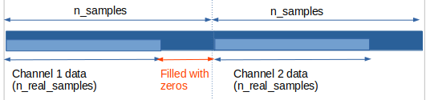

# ZMQ C++ Example

Minimal project to read data send by  OpenEphys ZMQ node. 

## Dependencies 

see requirement.txt - Install in anaconda or a pip environment 

```
sudo apt-get install libzmq3-dev
```

Dependencies installed through CMake Fetch_Content 
- CPPzmq
- json lib


## Build 

Activate the environment

```
mkdir build
cd build
cmake ..
make
mkdir build
./OpenEphysZMQReader
```

Turn On Open Ephys GUI with a ZMQ node. 

## How to use it - Receive data

*See class ZMQReader*

Input data to modify:

```
std::vector<int> channels= {1};
ZMQReader reader(channels,  "127.0.0.1", 5556);
```
- Ip address =  127.0.0.1 (fixed by OpenEphys for the moment)
- Port address = 5556 (fixed by OpenEphys for the moment)
- channels number to record 

Output data = 

- reader.samples (std::map<int, std::vector<float>>) = map channel integer with a std::vector filled with the data send by Open-Ephys GUI
- reader.timestamps (std::vector<uint64_t>) = timestamps for each samples
- reader.spike (std::vector<Event>) = Data structure with info for each received spike
- reader.event(std::vector<Event>)  = Data structure with info for each received event

You should then see this type of output in the example project : 

```
--- Start reading message ---
New message: {"content":{"n_channels":16,"n_real_samples":928,"n_samples":1024,"sample_rate":40000,"timestamp":132704},"data_size":65536,"message_no":2372,"type":"data"}
Received first valid data packet (TS = 132704).
928 samples has been collected in the buffer for future processing.

New message: {"content":{"n_channels":16,"n_real_samples":928,"n_samples":1024,"sample_rate":40000,"timestamp":133632},"data_size":65536,"message_no":2373,"type":"data"}
1856 samples has been collected in the buffer for future processing.

New message: {"content":{"n_channels":16,"n_real_samples":928,"n_samples":1024,"sample_rate":40000,"timestamp":134560},"data_size":65536,"message_no":2374,"type":"data"}
2784 samples has been collected in the buffer for future processing.
...
```

For each received message, n_real_samples are added to the samples_ buffer. 

#### Data message

A data message is send in 3 frames : 
- type: DATA
- header in JSON Format: 
    ```
    content:
        n_channels: 16
        n_real_samples: 928
        n_samples: 1024
        sample_rate: 40000
        timestamp: 20576544
    data_size: 65536
    message_no: 159894
    type: data
    ```
- data buffer 

*Example of the buffer architecture with 2 channels* : 



To read a specific channel : 
start index = n_samples * channel_number
stop index = n_samples * channel_number + n_real_samples
    
n_samples is fixed by the ZMQ Open-Ephys node while the n_real_samples is in function of the Open-Ephys source.


#### Event / Spike message

A event/spike message is send in 3 frames : 
- type
- header in JSON Format: 
    ```
    content:
        sample_num: sampleNum (number),
        event_id: id (number),
        event_channel: channel (number),
        timestamp: sample id (number)
    data_size: 65536
    message_no: 159894
    type: event
    ```


## How to register the app in OpenEphys

*See class ZMQRegister*

Send a heartbeat every 2secs with this JSON message format :

```
app: name_app
uiid: unique number
type: heartbeat
```

Then receive a confirmation message. 
```
heartbeat received
```
